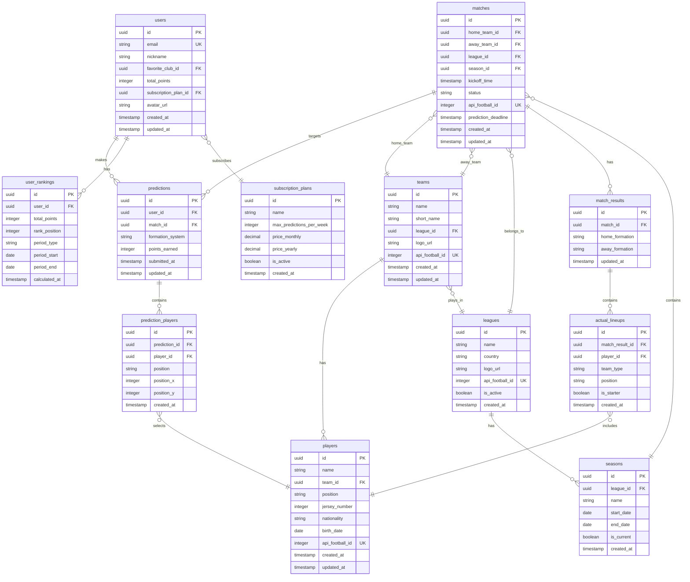

# PROVEXI データベース設計書

## 1. 概要

### 1.1. データベース選択理由
- **Supabase (PostgreSQL)**: オープンソース、リアルタイム機能、Row Level Security
- **スケーラビリティ**: 自動スケーリング対応
- **開発効率**: 認証・API・リアルタイム機能の統合

### 1.2. 設計原則
- **正規化**: 第3正規形まで正規化し、データの整合性を保つ
- **パフォーマンス**: 適切なインデックス設計
- **セキュリティ**: Row Level Security (RLS) による認可制御
- **拡張性**: 将来的な機能追加を考慮した設計

## 2. ER図



## 3. テーブル定義

### 3.1. ユーザー関連テーブル

#### users テーブル
```sql
CREATE TABLE users (
    id UUID PRIMARY KEY DEFAULT gen_random_uuid(),
    email VARCHAR(255) UNIQUE NOT NULL,
    nickname VARCHAR(50) NOT NULL,
    favorite_club_id UUID REFERENCES teams(id),
    total_points INTEGER DEFAULT 0,
    subscription_plan_id UUID REFERENCES subscription_plans(id) DEFAULT (
        SELECT id FROM subscription_plans WHERE name = 'Free' LIMIT 1
    ),
    avatar_url TEXT,
    created_at TIMESTAMP WITH TIME ZONE DEFAULT NOW(),
    updated_at TIMESTAMP WITH TIME ZONE DEFAULT NOW()
);

-- インデックス
CREATE INDEX idx_users_email ON users(email);
CREATE INDEX idx_users_total_points ON users(total_points DESC);
CREATE INDEX idx_users_subscription_plan ON users(subscription_plan_id);
```

#### subscription_plans テーブル
```sql
CREATE TABLE subscription_plans (
    id UUID PRIMARY KEY DEFAULT gen_random_uuid(),
    name VARCHAR(50) UNIQUE NOT NULL,
    max_predictions_per_week INTEGER NOT NULL,
    price_monthly DECIMAL(10,2),
    price_yearly DECIMAL(10,2),
    is_active BOOLEAN DEFAULT true,
    created_at TIMESTAMP WITH TIME ZONE DEFAULT NOW()
);

-- 初期データ
INSERT INTO subscription_plans (name, max_predictions_per_week, price_monthly, price_yearly) VALUES
('Free', 3, 0.00, 0.00),
('Premium', -1, 9.99, 99.99); -- -1 は無制限を表す
```

### 3.2. リーグ・チーム関連テーブル

#### leagues テーブル
```sql
CREATE TABLE leagues (
    id UUID PRIMARY KEY DEFAULT gen_random_uuid(),
    name VARCHAR(100) NOT NULL,
    country VARCHAR(50) NOT NULL,
    logo_url TEXT,
    api_football_id INTEGER UNIQUE NOT NULL,
    is_active BOOLEAN DEFAULT true,
    created_at TIMESTAMP WITH TIME ZONE DEFAULT NOW()
);

-- インデックス
CREATE INDEX idx_leagues_api_football_id ON leagues(api_football_id);
CREATE INDEX idx_leagues_is_active ON leagues(is_active);
```

#### seasons テーブル
```sql
CREATE TABLE seasons (
    id UUID PRIMARY KEY DEFAULT gen_random_uuid(),
    league_id UUID REFERENCES leagues(id) ON DELETE CASCADE,
    name VARCHAR(50) NOT NULL,
    start_date DATE NOT NULL,
    end_date DATE NOT NULL,
    is_current BOOLEAN DEFAULT false,
    created_at TIMESTAMP WITH TIME ZONE DEFAULT NOW(),
    
    CONSTRAINT unique_current_season_per_league 
        EXCLUDE (league_id WITH =) WHERE (is_current = true)
);

-- インデックス
CREATE INDEX idx_seasons_league_id ON seasons(league_id);
CREATE INDEX idx_seasons_is_current ON seasons(is_current);
```

#### teams テーブル
```sql
CREATE TABLE teams (
    id UUID PRIMARY KEY DEFAULT gen_random_uuid(),
    name VARCHAR(100) NOT NULL,
    short_name VARCHAR(10) NOT NULL,
    league_id UUID REFERENCES leagues(id) ON DELETE CASCADE,
    logo_url TEXT,
    api_football_id INTEGER UNIQUE NOT NULL,
    created_at TIMESTAMP WITH TIME ZONE DEFAULT NOW(),
    updated_at TIMESTAMP WITH TIME ZONE DEFAULT NOW()
);

-- インデックス
CREATE INDEX idx_teams_league_id ON teams(league_id);
CREATE INDEX idx_teams_api_football_id ON teams(api_football_id);
```

#### players テーブル
```sql
CREATE TABLE players (
    id UUID PRIMARY KEY DEFAULT gen_random_uuid(),
    name VARCHAR(100) NOT NULL,
    team_id UUID REFERENCES teams(id) ON DELETE CASCADE,
    position VARCHAR(20) NOT NULL, -- GK, DEF, MID, FWD
    jersey_number INTEGER,
    nationality VARCHAR(50),
    birth_date DATE,
    api_football_id INTEGER UNIQUE NOT NULL,
    created_at TIMESTAMP WITH TIME ZONE DEFAULT NOW(),
    updated_at TIMESTAMP WITH TIME ZONE DEFAULT NOW(),
    
    CONSTRAINT unique_jersey_per_team 
        UNIQUE(team_id, jersey_number)
);

-- インデックス
CREATE INDEX idx_players_team_id ON players(team_id);
CREATE INDEX idx_players_position ON players(position);
CREATE INDEX idx_players_api_football_id ON players(api_football_id);
```

### 3.3. 試合関連テーブル

#### matches テーブル
```sql
CREATE TABLE matches (
    id UUID PRIMARY KEY DEFAULT gen_random_uuid(),
    home_team_id UUID REFERENCES teams(id) ON DELETE CASCADE,
    away_team_id UUID REFERENCES teams(id) ON DELETE CASCADE,
    league_id UUID REFERENCES leagues(id) ON DELETE CASCADE,
    season_id UUID REFERENCES seasons(id) ON DELETE CASCADE,
    kickoff_time TIMESTAMP WITH TIME ZONE NOT NULL,
    status VARCHAR(20) DEFAULT 'SCHEDULED', -- SCHEDULED, LIVE, FINISHED, CANCELLED
    api_football_id INTEGER UNIQUE NOT NULL,
    prediction_deadline TIMESTAMP WITH TIME ZONE GENERATED ALWAYS AS (kickoff_time - INTERVAL '1 hour') STORED,
    created_at TIMESTAMP WITH TIME ZONE DEFAULT NOW(),
    updated_at TIMESTAMP WITH TIME ZONE DEFAULT NOW(),
    
    CONSTRAINT different_teams CHECK (home_team_id != away_team_id)
);

-- インデックス
CREATE INDEX idx_matches_kickoff_time ON matches(kickoff_time);
CREATE INDEX idx_matches_status ON matches(status);
CREATE INDEX idx_matches_league_season ON matches(league_id, season_id);
CREATE INDEX idx_matches_prediction_deadline ON matches(prediction_deadline);
CREATE INDEX idx_matches_api_football_id ON matches(api_football_id);
```

### 3.4. 予想関連テーブル

#### predictions テーブル
```sql
CREATE TABLE predictions (
    id UUID PRIMARY KEY DEFAULT gen_random_uuid(),
    user_id UUID REFERENCES users(id) ON DELETE CASCADE,
    match_id UUID REFERENCES matches(id) ON DELETE CASCADE,
    formation_system VARCHAR(10) NOT NULL, -- 4-4-2, 4-3-3, etc.
    points_earned INTEGER DEFAULT 0,
    submitted_at TIMESTAMP WITH TIME ZONE DEFAULT NOW(),
    updated_at TIMESTAMP WITH TIME ZONE DEFAULT NOW(),
    
    CONSTRAINT unique_user_match_prediction UNIQUE(user_id, match_id)
);

-- インデックス
CREATE INDEX idx_predictions_user_id ON predictions(user_id);
CREATE INDEX idx_predictions_match_id ON predictions(match_id);
CREATE INDEX idx_predictions_submitted_at ON predictions(submitted_at);
CREATE INDEX idx_predictions_points ON predictions(points_earned DESC);
```

#### prediction_players テーブル
```sql
CREATE TABLE prediction_players (
    id UUID PRIMARY KEY DEFAULT gen_random_uuid(),
    prediction_id UUID REFERENCES predictions(id) ON DELETE CASCADE,
    player_id UUID REFERENCES players(id) ON DELETE CASCADE,
    position VARCHAR(20) NOT NULL, -- GK, DEF, MID, FWD
    position_x INTEGER NOT NULL, -- ピッチ上のX座標 (0-100)
    position_y INTEGER NOT NULL, -- ピッチ上のY座標 (0-100)
    created_at TIMESTAMP WITH TIME ZONE DEFAULT NOW(),
    
    CONSTRAINT unique_player_per_prediction UNIQUE(prediction_id, player_id),
    CONSTRAINT valid_position_coordinates CHECK (
        position_x >= 0 AND position_x <= 100 AND
        position_y >= 0 AND position_y <= 100
    )
);

-- インデックス
CREATE INDEX idx_prediction_players_prediction_id ON prediction_players(prediction_id);
CREATE INDEX idx_prediction_players_player_id ON prediction_players(player_id);
```

### 3.5. 試合結果関連テーブル

#### match_results テーブル
```sql
CREATE TABLE match_results (
    id UUID PRIMARY KEY DEFAULT gen_random_uuid(),
    match_id UUID REFERENCES matches(id) ON DELETE CASCADE UNIQUE,
    home_formation VARCHAR(10),
    away_formation VARCHAR(10),
    updated_at TIMESTAMP WITH TIME ZONE DEFAULT NOW()
);

-- インデックス
CREATE INDEX idx_match_results_match_id ON match_results(match_id);
```

#### actual_lineups テーブル
```sql
CREATE TABLE actual_lineups (
    id UUID PRIMARY KEY DEFAULT gen_random_uuid(),
    match_result_id UUID REFERENCES match_results(id) ON DELETE CASCADE,
    player_id UUID REFERENCES players(id) ON DELETE CASCADE,
    team_type VARCHAR(10) NOT NULL, -- HOME, AWAY
    position VARCHAR(20) NOT NULL,
    is_starter BOOLEAN DEFAULT true,
    created_at TIMESTAMP WITH TIME ZONE DEFAULT NOW(),
    
    CONSTRAINT unique_player_per_match_result UNIQUE(match_result_id, player_id)
);

-- インデックス
CREATE INDEX idx_actual_lineups_match_result_id ON actual_lineups(match_result_id);
CREATE INDEX idx_actual_lineups_player_id ON actual_lineups(player_id);
CREATE INDEX idx_actual_lineups_team_type ON actual_lineups(team_type);
```

### 3.6. ランキング関連テーブル

#### user_rankings テーブル
```sql
CREATE TABLE user_rankings (
    id UUID PRIMARY KEY DEFAULT gen_random_uuid(),
    user_id UUID REFERENCES users(id) ON DELETE CASCADE,
    total_points INTEGER NOT NULL,
    rank_position INTEGER NOT NULL,
    period_type VARCHAR(20) NOT NULL, -- OVERALL, MONTHLY, WEEKLY
    period_start DATE,
    period_end DATE,
    calculated_at TIMESTAMP WITH TIME ZONE DEFAULT NOW(),
    
    CONSTRAINT unique_user_period_ranking UNIQUE(user_id, period_type, period_start, period_end)
);

-- インデックス
CREATE INDEX idx_user_rankings_period ON user_rankings(period_type, period_start, period_end);
CREATE INDEX idx_user_rankings_rank ON user_rankings(rank_position);
CREATE INDEX idx_user_rankings_user_id ON user_rankings(user_id);
```

## 4. Row Level Security (RLS) 設定

### 4.1. ユーザーデータの保護
```sql
-- users テーブルのRLS
ALTER TABLE users ENABLE ROW LEVEL SECURITY;

-- ユーザーは自分のデータのみ参照・更新可能
CREATE POLICY "Users can view own data" ON users
    FOR SELECT USING (auth.uid() = id);

CREATE POLICY "Users can update own data" ON users
    FOR UPDATE USING (auth.uid() = id);
```

### 4.2. 予想データの保護
```sql
-- predictions テーブルのRLS
ALTER TABLE predictions ENABLE ROW LEVEL SECURITY;

-- ユーザーは自分の予想のみ操作可能
CREATE POLICY "Users can manage own predictions" ON predictions
    FOR ALL USING (auth.uid() = user_id);

-- 試合開始後は他ユーザーの予想も閲覧可能
CREATE POLICY "View predictions after match start" ON predictions
    FOR SELECT USING (
        EXISTS (
            SELECT 1 FROM matches 
            WHERE matches.id = predictions.match_id 
            AND matches.kickoff_time < NOW()
        )
    );
```

### 4.3. 公開データのアクセス
```sql
-- 公開データは全ユーザーが閲覧可能
ALTER TABLE leagues ENABLE ROW LEVEL SECURITY;
CREATE POLICY "Public read access" ON leagues FOR SELECT USING (true);

ALTER TABLE teams ENABLE ROW LEVEL SECURITY;
CREATE POLICY "Public read access" ON teams FOR SELECT USING (true);

ALTER TABLE players ENABLE ROW LEVEL SECURITY;
CREATE POLICY "Public read access" ON players FOR SELECT USING (true);

ALTER TABLE matches ENABLE ROW LEVEL SECURITY;
CREATE POLICY "Public read access" ON matches FOR SELECT USING (true);
```

## 5. インデックス戦略

### 5.1. パフォーマンス重要クエリ
```sql
-- 1. ユーザーの週間予想数カウント
CREATE INDEX idx_predictions_user_week ON predictions(user_id, submitted_at)
WHERE submitted_at >= date_trunc('week', NOW());

-- 2. 試合の予想一覧取得
CREATE INDEX idx_predictions_match_points ON predictions(match_id, points_earned DESC);

-- 3. ランキング計算用
CREATE INDEX idx_users_points_subscription ON users(total_points DESC, subscription_plan_id);

-- 4. 試合検索用
CREATE INDEX idx_matches_league_date ON matches(league_id, kickoff_time);
```

### 5.2. 複合インデックス
```sql
-- 予想期限チェック用
CREATE INDEX idx_matches_deadline_status ON matches(prediction_deadline, status)
WHERE status = 'SCHEDULED';

-- チーム別選手検索用
CREATE INDEX idx_players_team_position ON players(team_id, position);
```

## 6. データ整合性制約

### 6.1. ビジネスルール制約
```sql
-- 予想は11人ちょうどでなければならない
CREATE OR REPLACE FUNCTION check_prediction_player_count()
RETURNS TRIGGER AS $$
BEGIN
    IF (SELECT COUNT(*) FROM prediction_players WHERE prediction_id = NEW.prediction_id) != 11 THEN
        RAISE EXCEPTION 'Prediction must have exactly 11 players';
    END IF;
    RETURN NEW;
END;
$$ LANGUAGE plpgsql;

CREATE TRIGGER trigger_check_prediction_player_count
    AFTER INSERT OR UPDATE ON prediction_players
    FOR EACH ROW EXECUTE FUNCTION check_prediction_player_count();
```

### 6.2. データ更新制約
```sql
-- 試合開始後の予想変更を防ぐ
CREATE OR REPLACE FUNCTION prevent_prediction_after_deadline()
RETURNS TRIGGER AS $$
BEGIN
    IF EXISTS (
        SELECT 1 FROM matches 
        WHERE id = NEW.match_id 
        AND prediction_deadline < NOW()
    ) THEN
        RAISE EXCEPTION 'Cannot modify prediction after deadline';
    END IF;
    RETURN NEW;
END;
$$ LANGUAGE plpgsql;

CREATE TRIGGER trigger_prevent_prediction_after_deadline
    BEFORE INSERT OR UPDATE ON predictions
    FOR EACH ROW EXECUTE FUNCTION prevent_prediction_after_deadline();
```

## 7. データマイグレーション戦略

### 7.1. バージョン管理
```sql
-- マイグレーション履歴テーブル
CREATE TABLE schema_migrations (
    version VARCHAR(255) PRIMARY KEY,
    applied_at TIMESTAMP WITH TIME ZONE DEFAULT NOW()
);
```

### 7.2. 段階的マイグレーション
1. **Phase 1**: 基本テーブル作成
2. **Phase 2**: インデックス・制約追加
3. **Phase 3**: RLS設定
4. **Phase 4**: トリガー・関数追加

## 8. バックアップ・復旧戦略

### 8.1. 自動バックアップ
- Supabaseの自動バックアップ機能を活用
- 日次フルバックアップ
- 時間単位の増分バックアップ

### 8.2. 重要データの保護
- ユーザーデータ: 暗号化保存
- 予想データ: 改ざん防止のためのハッシュ値保存
- 決済データ: 外部サービス（Stripe）に委託

この設計により、PROVEXIは拡張性・パフォーマンス・セキュリティを兼ね備えたデータベースシステムを実現します。