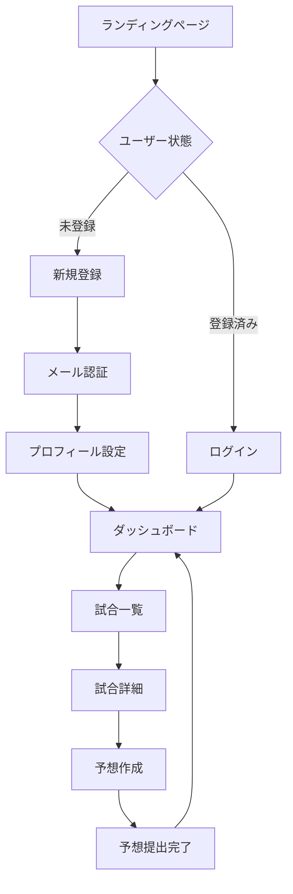
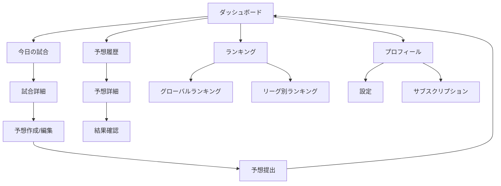

# PROVEXI 画面遷移設計書

## 1. 概要

### 1.1. 設計方針
- **ユーザー中心設計**: 直感的で迷わない画面遷移
- **タスク指向**: ユーザーの目的達成を最短経路で支援
- **一貫性**: 統一されたナビゲーションパターン
- **アクセシビリティ**: キーボードナビゲーション対応

### 1.2. 技術仕様
- **フレームワーク**: Next.js 15 App Router
- **ルーティング**: ファイルベースルーティング
- **状態管理**: URL状態 + React Query
- **アニメーション**: Framer Motion

## 2. サイトマップ

```
PROVEXI
├── / (ランディングページ)
├── /auth
│   ├── /login (ログイン)
│   ├── /register (新規登録)
│   └── /reset-password (パスワードリセット)
├── /dashboard (ダッシュボード) 🔒
├── /matches (試合一覧)
│   └── /[matchId] (試合詳細)
│       └── /predict (予想作成/編集) 🔒
├── /predictions (予想履歴) 🔒
│   └── /[predictionId] (予想詳細) 🔒
├── /rankings (ランキング)
│   ├── /global (グローバルランキング)
│   └── /leagues/[leagueId] (リーグ別ランキング)
├── /profile (プロフィール) 🔒
│   ├── /settings (設定) 🔒
│   └── /subscription (サブスクリプション) 🔒
└── /help (ヘルプ・FAQ)

🔒 = 認証が必要なページ
```

## 3. 画面遷移フロー

### 3.1. 新規ユーザーフロー



### 3.2. 既存ユーザーフロー



## 4. 画面別詳細設計

### 4.1. ランディングページ (/)

**目的**: サービスの価値提案とユーザー獲得

**主要要素**:
- ヒーローセクション
- 機能紹介
- CTA（新規登録/ログイン）

**遷移先**:
```typescript
interface LandingPageTransitions {
  '/auth/register': '新規登録ボタン';
  '/auth/login': 'ログインボタン';
  '/matches': '試合を見るボタン（ゲスト）';
  '/rankings': 'ランキングを見るボタン';
}
```

### 4.2. 認証関連ページ (/auth/*)

#### ログインページ (/auth/login)
**目的**: 既存ユーザーの認証

**フォーム要素**:
- メールアドレス
- パスワード
- ログイン状態を保持するチェックボックス

**遷移パターン**:
```typescript
interface LoginTransitions {
  success: '/dashboard'; // ログイン成功
  '/auth/register': '新規登録リンク';
  '/auth/reset-password': 'パスワードを忘れた方';
  '/': 'キャンセル';
}
```

#### 新規登録ページ (/auth/register)
**目的**: 新規ユーザーのアカウント作成

**フォーム要素**:
- メールアドレス
- パスワード
- パスワード確認
- ニックネーム
- お気に入りクラブ（任意）

**遷移パターン**:
```typescript
interface RegisterTransitions {
  success: '/dashboard'; // 登録成功
  '/auth/login': 'ログインリンク';
  '/': 'キャンセル';
}
```

### 4.3. ダッシュボード (/dashboard)

**目的**: ユーザーの活動状況とクイックアクセス

**主要セクション**:
- 今日の試合
- 最近の予想
- ポイント・ランキング状況
- 週間予想残数

**遷移パターン**:
```typescript
interface DashboardTransitions {
  '/matches': '試合一覧を見る';
  '/matches/[id]': '個別試合カード';
  '/predictions': '予想履歴を見る';
  '/rankings': 'ランキングを見る';
  '/profile': 'プロフィール';
}
```

### 4.4. 試合関連ページ

#### 試合一覧ページ (/matches)
**目的**: 予想対象試合の一覧表示

**フィルター機能**:
- リーグ別
- 日付別
- ステータス別（予想受付中/終了/結果確定）

**遷移パターン**:
```typescript
interface MatchesTransitions {
  '/matches/[id]': '試合詳細';
  '/matches/[id]/predict': '予想作成（直接）';
  '/dashboard': 'ダッシュボードに戻る';
}
```

#### 試合詳細ページ (/matches/[matchId])
**目的**: 試合情報の詳細表示と予想への導線

**表示情報**:
- 試合基本情報
- チーム情報・選手一覧
- 予想期限
- 既存の予想（あれば）

**遷移パターン**:
```typescript
interface MatchDetailTransitions {
  '/matches/[id]/predict': '予想作成/編集';
  '/predictions/[id]': '既存予想詳細';
  '/matches': '試合一覧に戻る';
  '/teams/[id]': 'チーム詳細（将来実装）';
}
```

#### 予想作成/編集ページ (/matches/[matchId]/predict)
**目的**: フォーメーション予想の作成・編集

**主要機能**:
- ドラッグ&ドロップによる選手配置
- フォーメーションシステム選択
- リアルタイム保存

**遷移パターン**:
```typescript
interface PredictTransitions {
  success: '/dashboard'; // 提出成功
  '/matches/[id]': '試合詳細に戻る';
  cancel: '/matches/[id]'; // キャンセル
}
```

### 4.5. 予想履歴ページ (/predictions)

**目的**: ユーザーの予想履歴と成績確認

**表示要素**:
- 予想一覧（日付順）
- フィルター（期間、リーグ、ステータス）
- 統計情報

**遷移パターン**:
```typescript
interface PredictionsTransitions {
  '/predictions/[id]': '予想詳細';
  '/matches/[id]': '対象試合詳細';
  '/dashboard': 'ダッシュボードに戻る';
}
```

### 4.6. ランキングページ (/rankings)

**目的**: 競争要素の提供とモチベーション向上

**タブ構成**:
- グローバルランキング
- リーグ別ランキング
- 期間別ランキング

**遷移パターン**:
```typescript
interface RankingsTransitions {
  '/rankings/global': 'グローバルランキング';
  '/rankings/leagues/[id]': 'リーグ別ランキング';
  '/profile/[userId]': '他ユーザープロフィール（将来実装）';
}
```

## 5. ナビゲーション設計

### 5.1. メインナビゲーション

**デスクトップ版**:
```typescript
interface MainNavigation {
  logo: '/dashboard'; // ロゴクリックでダッシュボード
  items: [
    { label: 'ダッシュボード', href: '/dashboard' },
    { label: '試合', href: '/matches' },
    { label: '予想履歴', href: '/predictions' },
    { label: 'ランキング', href: '/rankings' }
  ];
  userMenu: {
    trigger: 'アバター/ニックネーム';
    items: [
      { label: 'プロフィール', href: '/profile' },
      { label: '設定', href: '/profile/settings' },
      { label: 'サブスクリプション', href: '/profile/subscription' },
      { label: 'ヘルプ', href: '/help' },
      { label: 'ログアウト', action: 'logout' }
    ];
  };
}
```

**モバイル版**:
```typescript
interface MobileNavigation {
  bottomTabs: [
    { icon: 'Home', label: 'ホーム', href: '/dashboard' },
    { icon: 'Calendar', label: '試合', href: '/matches' },
    { icon: 'Target', label: '予想', href: '/predictions' },
    { icon: 'Trophy', label: 'ランキング', href: '/rankings' }
  ];
  hamburgerMenu: {
    items: [
      { label: 'プロフィール', href: '/profile' },
      { label: '設定', href: '/profile/settings' },
      { label: 'ヘルプ', href: '/help' },
      { label: 'ログアウト', action: 'logout' }
    ];
  };
}
```

### 5.2. パンくずナビゲーション

```typescript
interface BreadcrumbPatterns {
  '/matches/[id]': ['ホーム', '試合一覧', '試合詳細'];
  '/matches/[id]/predict': ['ホーム', '試合一覧', '試合詳細', '予想作成'];
  '/predictions/[id]': ['ホーム', '予想履歴', '予想詳細'];
  '/rankings/leagues/[id]': ['ホーム', 'ランキング', 'リーグ別'];
}
```

## 6. 状態管理と画面遷移

### 6.1. URL状態管理

```typescript
// 試合一覧のフィルター状態
interface MatchesSearchParams {
  league?: string;
  date?: string;
  status?: string;
  page?: string;
}

// ランキングの表示状態
interface RankingsSearchParams {
  period?: 'overall' | 'monthly' | 'weekly';
  league?: string;
  page?: string;
}
```

### 6.2. 画面遷移時のデータ保持

```typescript
// 予想作成中のデータ保持
interface PredictionDraft {
  matchId: string;
  formation: FormationData;
  lastSaved: Date;
  autoSave: boolean;
}

// 戻るボタン対応
interface NavigationState {
  previousPage: string;
  scrollPosition: number;
  filterState: any;
}
```

## 7. エラー状態とフォールバック

### 7.1. エラーページ

```typescript
interface ErrorPages {
  '/404': 'ページが見つかりません';
  '/500': 'サーバーエラー';
  '/403': 'アクセス権限がありません';
  '/offline': 'オフライン状態';
}
```

### 7.2. 認証が必要なページのリダイレクト

```typescript
interface AuthRedirect {
  pattern: '認証が必要なページにアクセス';
  redirect: '/auth/login?redirect=${currentPath}';
  afterLogin: '元のページにリダイレクト';
}
```

## 8. アニメーション・トランジション

### 8.1. ページ遷移アニメーション

```typescript
interface PageTransitions {
  default: {
    initial: { opacity: 0, y: 20 };
    animate: { opacity: 1, y: 0 };
    exit: { opacity: 0, y: -20 };
    transition: { duration: 0.3 };
  };
  modal: {
    initial: { opacity: 0, scale: 0.95 };
    animate: { opacity: 1, scale: 1 };
    exit: { opacity: 0, scale: 0.95 };
  };
}
```

### 8.2. インタラクションフィードバック

```typescript
interface InteractionFeedback {
  buttonClick: 'scale(0.95) + haptic feedback';
  cardHover: 'subtle lift + border glow';
  formSubmit: 'loading spinner + disabled state';
  success: 'checkmark animation + toast';
  error: 'shake animation + error toast';
}
```

## 9. レスポンシブ対応

### 9.1. ブレークポイント別ナビゲーション

```typescript
interface ResponsiveNavigation {
  mobile: '< 768px - Bottom tabs + Hamburger menu';
  tablet: '768px - 1024px - Horizontal nav + Sidebar';
  desktop: '> 1024px - Full navigation bar';
}
```

### 9.2. 画面サイズ別レイアウト調整

```typescript
interface ResponsiveLayouts {
  predictionForm: {
    mobile: 'Single column, stacked layout';
    tablet: 'Two column, side-by-side';
    desktop: 'Three column with sidebar';
  };
  matchList: {
    mobile: 'Card stack';
    tablet: 'Grid 2x2';
    desktop: 'Grid 3x3 + filters sidebar';
  };
}
```

## 10. パフォーマンス最適化

### 10.1. ページ読み込み最適化

```typescript
interface LoadingOptimization {
  prefetch: [
    'Next page in pagination',
    'Likely next match details',
    'User profile data'
  ];
  lazyLoad: [
    'Match images',
    'Player photos',
    'Historical data'
  ];
  caching: [
    'Static match data',
    'Team/player information',
    'User preferences'
  ];
}
```

### 10.2. 画面遷移の最適化

```typescript
interface TransitionOptimization {
  instantNavigation: 'Cached pages load instantly';
  progressiveLoading: 'Show skeleton → partial data → complete';
  backgroundSync: 'Update data while user navigates';
}
```

この設計により、PROVEXIは直感的で効率的な画面遷移を実現し、ユーザーの目的達成を最適にサポートします。